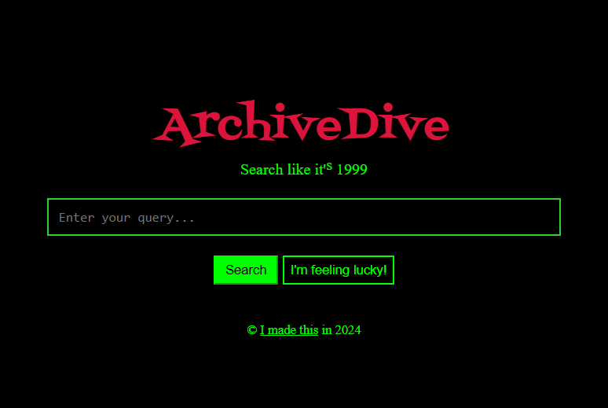

# ArchiveDive
Last Update: 15/11/2024\
Contributors: hekate2



## About this tool
ArchiveDive is a search engine which both searches and archives older websites created before 2004.  Try it out at: [ArchiveDive.net](https://ArchiveDive.net);

## Try it out yourself
To run archivedive locally, first clone this repo, then run the front-end and back-end seperately.

The front-end files can be found in the `public` folder.  After navigating to it on the command line, run:
```
npm run dev
```
The back-end files can be found in the `search` folder.  In order to run these you'll first have to install the dependencies in `requirements.txt` with:
```
pip install -r requirements.txt
```
Then, to run the server just run `TODO: update with setup instructions when I create a flask server`